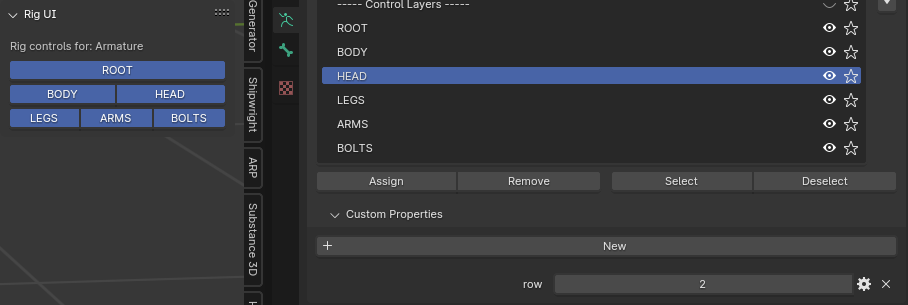

# SpiderclamKit

Just a blender addon for myself.

## Installation

Download zip. Install zip. Idk, you'll figure it out.

## Usage

By default a rigging panel to toggle bone collection visibility is added.

To use this add custom properties to the bone collections that should be grouped named `row`.
The value of row defines (in order) which row they will be rendered on.

Besides the panel there's a pie menu, which is toggled by pressing `alt`+`shift`+`o`.

## Operations

I'll try my best to document the included operations.

### Armature operations

I found it very frustrating to create and align bones.

Select the mesh, select vertices, move the cursor to selected, back to object mode, select the armature, select the bone, move to cursor, back to object mode...

So instead this addon keeps track of the last active armature, allowing you to perform operations on it without switching modes and selections.

Here are a couple.

**Note:** these operations (with the exception of Add bone at cursor) assume you have a tail selected.

### Extrude bone to cursor

Extrude the last selected tail, and align extruded bone to cursor. Newly extruded bone's tail will be active after.

### Add bone at cursor

Adds a new bone at the cursor position. New created bone's tail will be active after.

### Move bone to cursor

Move the selected bone to the cursor. This is useful for example after creating a new bone.

### Make ORG bones

Make target bones for selected deformation bones.

In armature edit mode, this will:

- Duplicate all selected bones
- Prefix those new bones with ORG*, removing the DEF* prefix
- Create a new ORG bone collection
- Move the new bones to that collection
- Remove the bones from the DEF collection (if found)
- Set up a Copy Transforms constraint on the DEF bone, targeting the new ORG bone

#### Notes:

- Selected bones must be prefixed with DEF\_
- ORG is used because these get ignored in keyframes (where TGT is not)

### Reset transform For Selection

Resets scale, rotation and location on all selected, in all modes.

### SetDistanceBySelected

Allows you to quickly get and set the distance of selected bones on the active bone's limit distance constraint.

#### Usage:

Select all the bones in the chain of which you want the sum of their lengths to be set as the distance on the last selected bone and run the operation.

#### Notes:

- The last selected bone's length is not included in the sum unless checked in the option panel
- The last selected bone must have a Limit Distance constraint set up

## Naming

I have no clue about naming conventions, since every addon seems to do its own thing.

So I made my own and documented the parts I care about.

### `bl_idname`

> sc.{abbreviation}\_{operation_name_in_snake_case}

Where sc stands for spiderclam

For example the `limit_distance_constraint` submodule of the `constraint_operations` module would have the abbreviation `co_ldc`.

Inside of that submodule is an operation class named `SetDistanceBySelected`.

So the full id would be:

`sc.co_ldc_set_distance_by_selected`

## LICENSE

MIT
